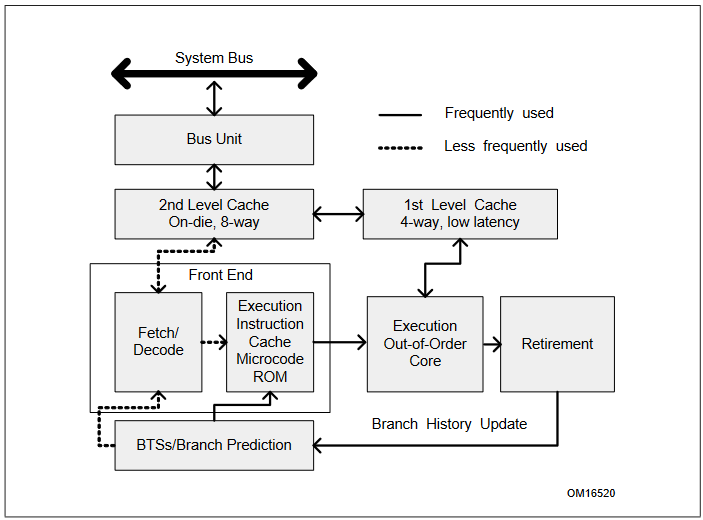

<div dir="rtl">

## چند نکته در رابطه با این متن
در این متن به جزئیاتی مرتبط با حمله‌ی ‌spectre پرداخته شده است. این جزئیات مبتنی بر برخی مفاهیم مانند segmentation, paging, privilege levels در پردازنده‌های intel است. این که مواردی از این دست دقیقا چطور پیاده سازی شده‌اند و چه جزئیاتی دارند بسیار طولانی است و امکان پرداخت به آن در اینجا وجود ندارد و صرفا اشاره‌ای  به آنها جهت مشخص شدن جایگاه‌شان در موضوع شده است. جزئیات متفرقه و چگونگی exploit کردن در ‌spectre نیز مطرح نشده و فرض شده است که خواننده با ‌spectre آشنایی حداقلی دارد.

لازم به ذکر است که مبنا و مبنع اصلی این متن مستندات شرکت intel است که تحت عنوان Intel-64-and-IA32-manual است و در همین مخزن می‌توانید نسخه‌ای که مورد استفاده قرار گرفته را مشاهده کنید. همچنین در نقاط مختلف این متن به بخش‌های استفاده شده از مستند با ذکر شماره صفحه و عنوان آن پرداخته شده است.

## شرح مسئله
قابلیت اجرای خارج از ترتیب یا out of order execution امروزه تقریبا در تمامی پردازنده‌های intel در کامپیوترها دیده می‌شود. این قابلیت به پردازنده امکان می‌دهد تا هنگامی که منتظر اتمام اجرای یک دستور است به سراغ دستورات دیگری برود و آنها را اجرا کند و در نهایت با روش‌هایی وابستگی داده‌های این دستورات را پیدا کرده و طوری نتیاج آنها را ثبت کند که انگار به ترتیب و پشت سر هم اجرا شده‌اند. در این حوزه یکی از قابلیت‌های پردازنده‌های intel اجرای پیشبینی شده یا speculative execution است و این امکان را فراهم می‌کند که بتوانیم نتیجه‌ی branch‌ها را پیشبینی کنیم تا کارایی برنامه بالا برود.

حمله‌ی ‌spectre که speculative execution را هدف قرار می‌دهد توضیحات مفصلی دارد که می‌توانید در [این پیوست](https://spectreattack.com/spectre.pdf) آنرا مشاهده کنید و در این متن به توضیح آن نمی پردازیم و تنها مسئله‌ای مربوط به آن را مطرح می‌کنیم و به آن پاسخ می‌دهیم.

قطعه کد زیر بخشی از exploit مربوط به حمله‌ی ‌spectre است<sup>[1]</sup> :

</div>

```c
if (x < array1_size){
    y = array2[array1[x] * 4096];
}
```

<div dir="rtl">

در این قطعه کد هدف این است که با اجرای مکرر آن branch predictor را طوری آموزش دهیم که همیشه به داخل `if` برود و بعد مقدار `x` را طوری تنظیم کنیم که وارد `if` نشویم ولی اگر با آن مقدار وارد `if` می‌شدیم حافظه را به صورت out of bound می‌خواندیم و برنامه با crash مواجه می‌شد. طی این فرایند در ‌spectre مقداری که به آن دسترسی نداشتیم در cache ذخیره می‌شد و می‌توانستیم با حملات کانال جانبی یا side channel attack‌ها مقدار خانه‌ای از حافظه که به آن دسترسی نداشتیم را بخوانیم.

**حال سوال اصلی این متن این است که اگر کد داخل `if` در حالت عادی با مقدار خاصی از `x` به صورت out of bound حافظه را می‌خواند و برنامه crash می‌کند چگونه اگر همان کد به صورت speculative اجرا شود crash‌ای رخ نمی دهد؟**

## پاسخ
### دو سوال اصلی
برای پاسخ به این سوال باید دو مورد را بررسی کنیم

1. به چه علت و چگونه crash ذکر شده در کد رخ می‌دهد؟
2. اجرا به صورت speculative چگونه است که در آن crash رخ نمی دهد؟

### پاسخ سوال اول
به صورت کوتاه پاسخ در وقفه‌ها یا interrupt‌ها نهفته است. یکی از ویژگی‌هایی که پردازنده در اختیار سیستم عامل قرار می‌دهد بررسی و اعلام رخ دادن برخی از وقایع به سیستم عامل در صورت بروز آنها می‌باشد. یادآوری این نکته ضروری است که در حمله‌ی ‌spectre فرض می‌کنیم می‌خواهیم بخشی از حافظه‌ی kernel را بخوانیم که در پردازه‌ی ما map شده است ولی اجازه‌ی دسترسی به طور مستقیم به آن را نداریم. هنگام خواندن خانه‌ای از حافظه cpu بر مبنای قابلیت‌های پیچیده و متعدد موجود در segmentation و paging بررسی‌هایی را انجام می‌دهد که نتیجه‌ی یکی از این بررسی‌ها رخ داد general protection exception است. این رخداد در یکی از حالات به طور کلی بررسی می‌کنه که آیا کد فعلی که در حال اجرا است سطح دسترسی لازم برای خواندن از حافظه با virtual address‌ای که داده است را دارد یا خیر. اگر چنین امکانی نداشت با general protection exception که interrupt شماره 13 است مواجه می‌شود و سیستم عامل کد مربوط به این interrupt را اجرا می‌کند و پردازه را خاتمه می‌دهد. <sup>[2]</sup>

حال با این دید که خواندن غیر مجاز ما از حافظه با امکانات سخت افزاری بررسی می‌شود باید ببینیم جایگاه interrupt‌ها در speculative execution چیست.

برای این کار باید به سوال 2 بپردازیم و قابلیت speculative execution در پردازنده‌های intel را بررسی کنیم.

### سوال دوم
ابتدا کمی به تاریخچه‌ی این ویژگی می‌پردازیم که از کدام نسل پردازنده‌های intel شروع شد.

برای اولین بار intel در پردازنده‌های خانواده‌ی P6 قابلیت out of order execution را اضافه کرد و نسل‌های رایجی که امروزه استفاده می‌کنیم (مانند core) بر پایه‌ی همان microarchitecture است. <sup>[3]</sup> در شکل زیر طراحی ذکر شده در خانواده‌ی P6 را مشاهده می‌کنید <sup>[4]</sup> :



در این طراحی سه مفهوم اصلی برای میسر شدن out of order execution و speculative execution موجود است.

1. ‌Deep branch prediction: به پردازنده این قابلیت را می‌دهد که نتیجه‌ی branch‌ها را بررسی کند و بر مبنای آنها پیشبینی خود را از branch‌های بعدی دقیق تر کند.
2. ‌Dynamic data flow analysis: وظیفه دارد ارتباط و وابستگی داده‌ای بین دستورات مختلف را به دست آورده تا در نهایت نتیجه‌ی دستورات طوری کنار هم قرار بگیرند که انگار به ترتیب اجرا شده‌اند.
3. ‌Speculative execution: اشاره به اجرای دستورات با توجه به پیشبینی انجام شده دارد که می‌تواند هنگام مشغول بودن cpu به اجرای یک دستور به سراغ دستورات دیگر برود و آنها را اجرا کند. <sup>[5]</sup>

توضیح کلی این طراحی چنین است که بخش Fetch/Decode از cache دستورات را خوانده و decode می‌کند و به بخش Execution Out-of-Order Core می‌دهد. این همان بخشی است که دستورات را به صورت خارج از ترتیب اجرا می‌کند. در این بخش رجیستر‌هایی وجود دارد که نتایج در آنها به صورت موقت ذخیره می‌شوند تا در نهایت کنار هم قرار گرفته و در حافظه و رجیستر‌ها ثبت نهایی شوند. این بخش با Retirement و cache در ارتباط است. این همان نقطه‌ای است که side channel در ‌spectre رخ می‌دهد. بخش Retirement همان بخشی است که ثبت نهایی دستورات در آن رخ می‌دهد و اگر دقت کنید مشاهده می‌کنید که هیچ ارتباطی با cache‌ها ندارد و فقط به BTSs/Branch Prediction با توجه به نتایج نهایی دستورات hint‌های لازم را می‌دهد که در fetch‌های بعدی مورد استفاده قرار بگیرد. در حقیقت آن بخشی که روی cache تاثیر می‌گذارد و کد را اجرا می‌کند همان بخش out of order executor است و به همین دلیل cache تغییر کرده و می‌توانیم با side channel‌ها مقادیر حافظه را بخوانیم.

حال به بررسی جایگاه interrupt‌ها در این طراحی می‌پردازیم. متن زیر عینا از مستند Intel-64-and-IA32-manual آورده شده است:

<div>

<div dir="ltr">

*'The ability of a P6 family processor to speculatively execute instructions does not affect the taking of interrupts by
the processor. Interrupts are taken at instruction boundaries located during the retirement phase of instruction
execution; so they are always taken in the “in-order” instruction stream.'* <sup>[6]</sup>

</div>

</div dir="rtl">

همانطور که از متن مشخص است این که interrupt‌ای رخ داده است در بخش Retirement و برای دستورات به ترتیب واقعی‌شان بررسی می‌شود و تاثیری بر Execution Out-of-Order Core ندارد. به این ترتیب است که در ‌spectre می‌توانیم یک دستور را هم به نوعی اجرا کنیم و با side channel‌ها تاثیرش را به دست آوریم و هم از رخ دادن interrupt‌ای که عمل ما را مختل کند و منجر به crash کردن برنامه شود با وارد نشدن به مرحله‌ی Retirement به وسلیه‌ی غلط شدن شرط `if` اجتناب کنیم.

</div>

[1]: <https://cs155.stanford.edu/lectures/17-processor.pdf> "spectre code snippet"
[2]: <../Intel-64-and-IA32-manual.pdf#G45.2001> "Volume-3 6.15 Page-3013"
[3]: <https://en.wikipedia.org/wiki/Out-of-order_execution> "Intel P6 and Core family history"
[4]: <../Intel-64-and-IA32-manual.pdf#G4.18719> "Volume-1 2.2.1 Page 43"
[5]: <../Intel-64-and-IA32-manual.pdf#G4.18719> "Volume-1 2.2.1 Page 44"
[6]: <../Intel-64-and-IA32-manual.pdf#G45.8531> "Volume-3 6.6 Page 2978"